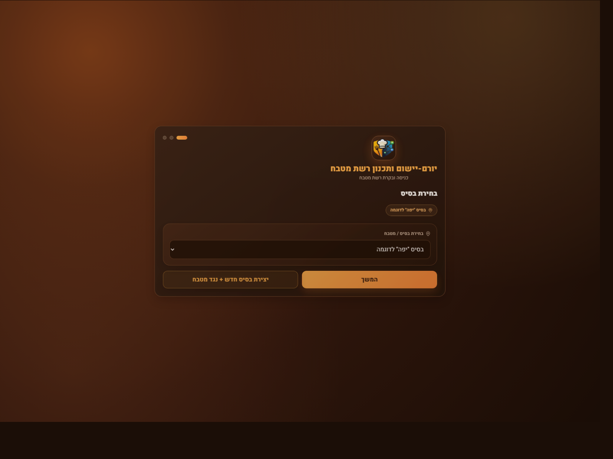
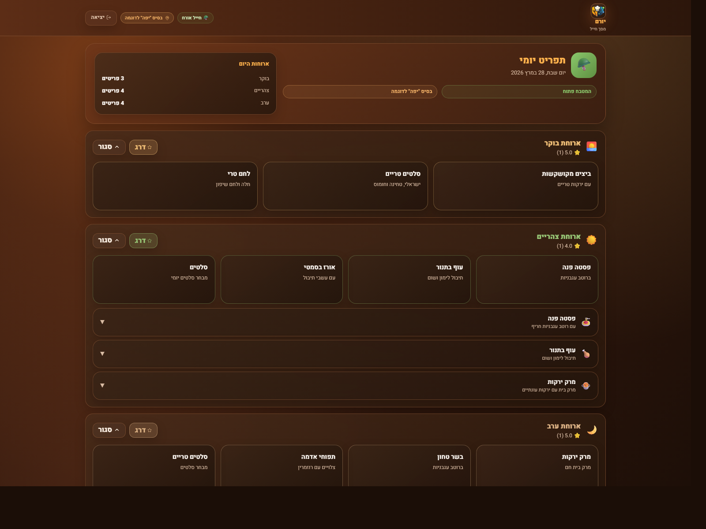
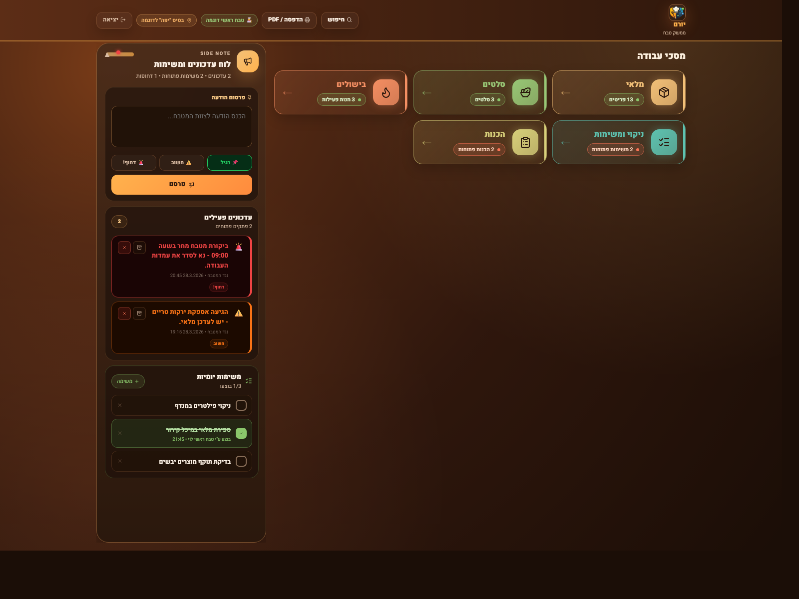
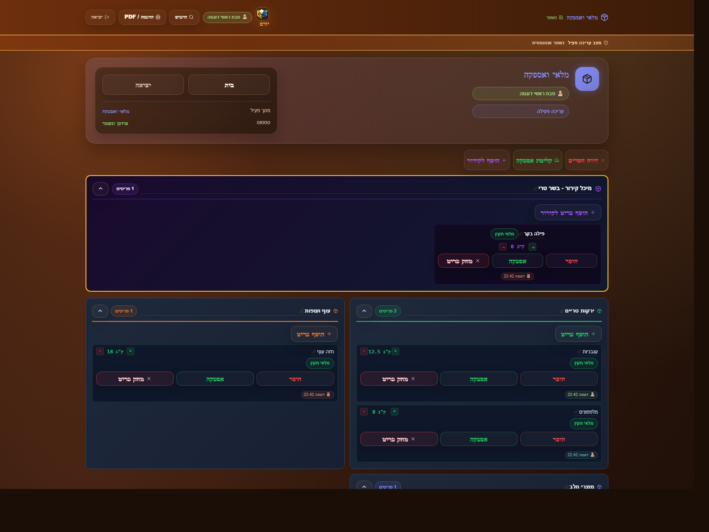
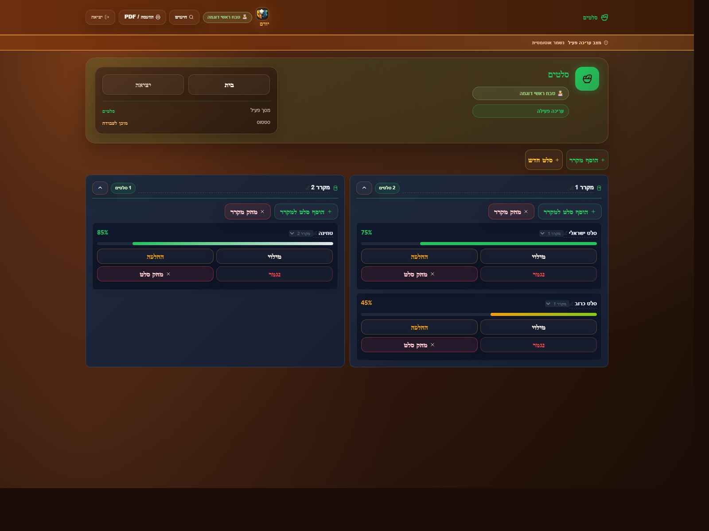
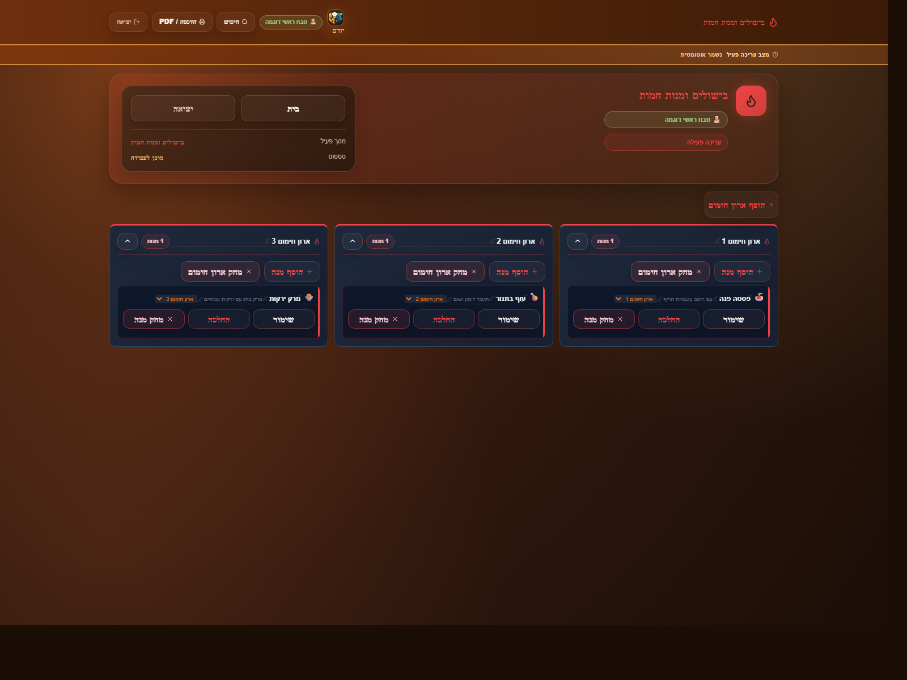
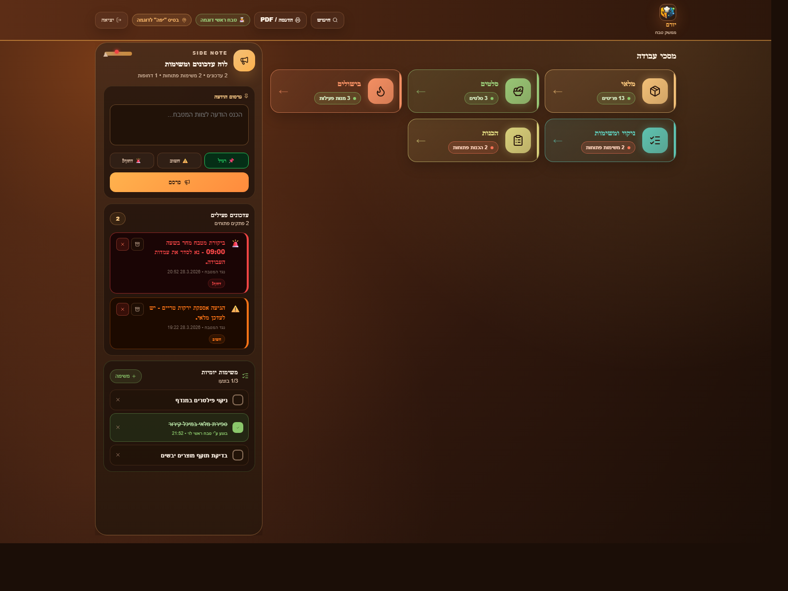
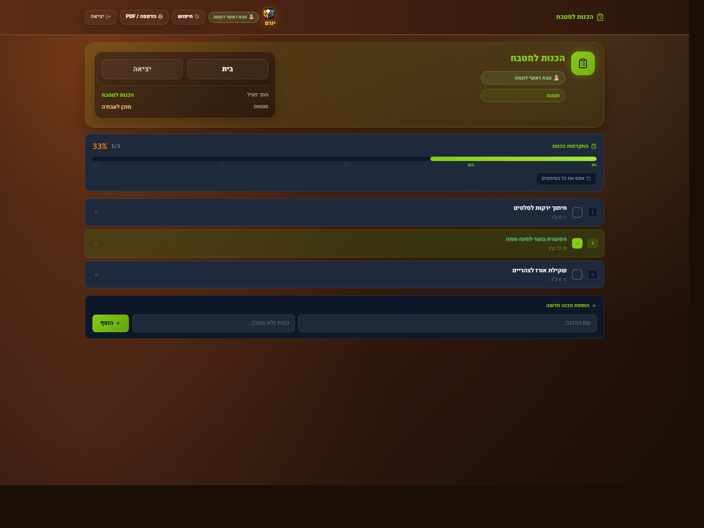
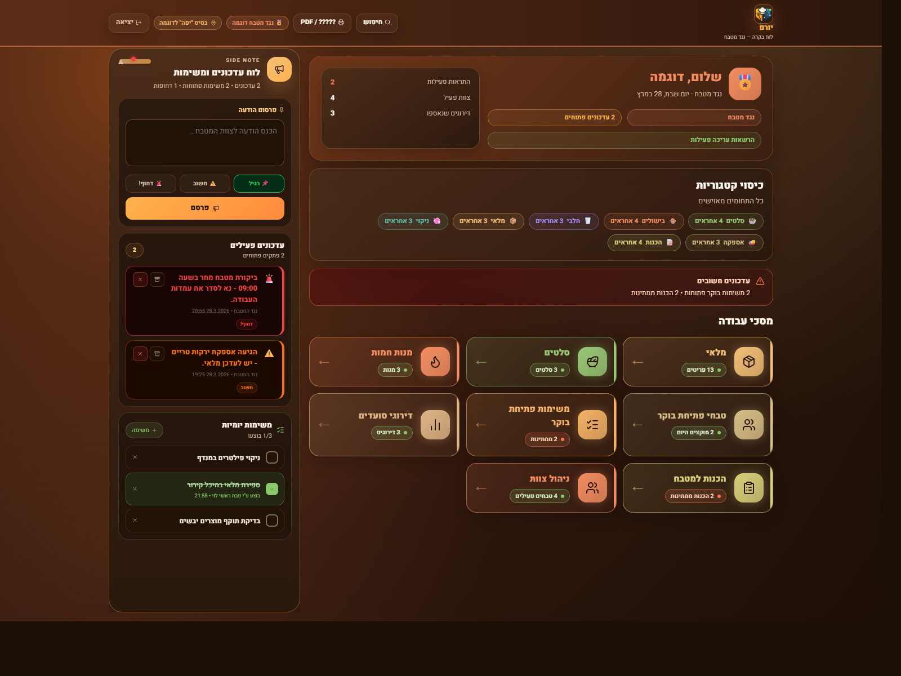
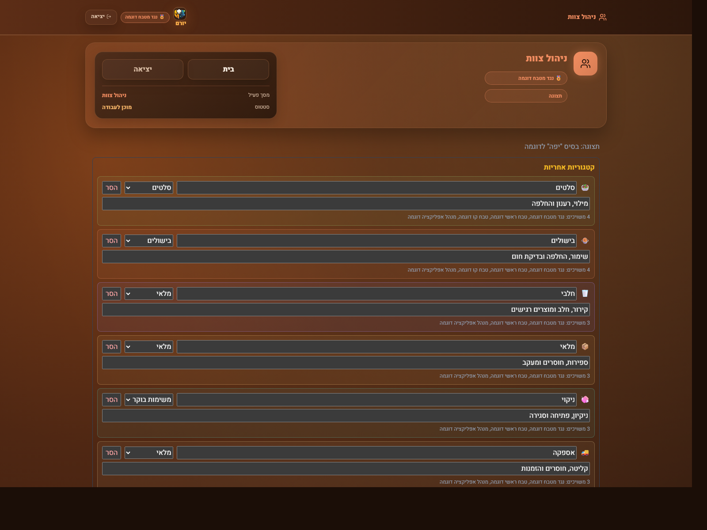

# IDF Kitchen

Mobile-first kitchen operations app for managing food service workflows across one or more bases.

Suggested repo description:
`Multi-base kitchen management app with role-based access, Firebase sync, and web/mobile support.`

## Overview

`idf-kitchen` is a React + Vite application with Capacitor support for Android and iOS. It is designed for daily kitchen operations and gives different experiences to soldiers, cooks, kitchen managers, and app managers.

The app combines operational tracking, staff coordination, and base-specific data in one place, with Firebase/Firestore sync and local cache fallbacks.

## Screenshot Gallery

The screenshots below were captured from the running app using seeded demo data, so the README reflects the real UI instead of mockups.

### Login

#### Login Screen



> **What it represents:** The entry point for selecting the working base and signing into the correct kitchen context.  
> **What's inside:** The app badge and title, a base selector, a user or role selector, a primary `Continue` button, and a secondary action for creating a fresh demo base and kitchen.  
> **What each part does:** The selectors choose where and as whom to enter, `Continue` loads the app with that context, and the demo action seeds a clean environment for testing, screenshots, or onboarding.

### Soldier View

#### Soldier Daily Menu



> **What it represents:** The soldier-facing daily meal board for checking what is being served across the day.  
> **What's inside:** A top status strip for the active base and view, a daily summary card, and separate meal sections for breakfast, lunch, and dinner with dish cards and expandable rows.  
> **What each part does:** The summary card shows the current service window, each meal block groups the relevant dishes, the small cards preview menu items, and the expandable rows let soldiers inspect more detail before rating or giving feedback.

### Cook Views

#### Cook Dashboard



> **What it represents:** The cook's main operations hub for jumping into the active kitchen workflows.  
> **What's inside:** A utility bar for search, export, and context, a left `Side Note` column for quick updates, active alerts, and daily missions, and a grid of shortcut cards for stock, salads, hot food, prep, and cleaning.  
> **What each part does:** The note composer publishes updates, the alert cards surface urgent issues, the daily mission list tracks what is done, and the large cards open each operational work area with live counters.

#### Cook Inventory Page



> **What it represents:** The stock management screen used by cooks to monitor supplies by category.  
> **What's inside:** A header summary for the current base and page, action chips for export or filtering, and collapsible inventory sections such as dry storage, vegetables, cleaning supplies, and frozen items.  
> **What each part does:** Each stock row shows the product name, quantity, and status, while the row actions let the team update counts, mark shortages, or remove items so the inventory stays accurate during service.

#### Cook Salads Page



> **What it represents:** The salad station tracker for refrigerated trays and refill readiness.  
> **What's inside:** A page summary card, quick actions for adding a fridge or a new salad, and fridge panels that list each salad with its current percentage fill.  
> **What each part does:** The fridge cards organize salads by location, the percentage bar shows remaining quantity at a glance, and the action buttons let staff refill, replace, empty, move, or delete a salad entry.

#### Cook Hot Food Page



> **What it represents:** The hot-food control view for following dishes across cooking or heating zones.  
> **What's inside:** A page summary block and several zone cards, each tied to one active dish and showing the dish name together with quick action controls.  
> **What each part does:** The zone cards represent separate burners or serving positions, the dish row identifies what is cooking there, and the buttons help cooks replace a dish, clear a finished item, or update its serving status as the line changes.

#### Cook Morning Tasks Page



> **What it represents:** The cook workspace overview with the morning workflow widgets visible on the left side.  
> **What's inside:** The `Side Note` panel for quick posting, urgent updates, the daily checklist, and the same navigation cards that lead into the operational modules used during the morning shift.  
> **What each part does:** The left column helps the shift communicate and close routine tasks, while the large cards on the right route the cook into the exact area that now needs attention.

#### Cook Prep Page



> **What it represents:** The prep-task board for organizing kitchen preparation work before or between meal windows.  
> **What's inside:** A summary header, a completion progress bar, a list of prep tasks with checkboxes and counters, and a form row for adding a new task.  
> **What each part does:** The progress bar shows how much of the prep plan is complete, each task row can be checked off when finished, and the bottom input area lets staff append new prep work as needs change.

### Nagad Views

#### Nagad Dashboard



> **What it represents:** The management dashboard for the `nagad`, combining staffing awareness and operational control in one place.  
> **What's inside:** A left column for notes, urgent updates, and the daily checklist, a top summary panel with counts and current base context, category chips for staffing coverage, and a larger grid of management modules.  
> **What each part does:** The summary panel reports kitchen health at a glance, the category chips highlight who is assigned where, the warning banner surfaces shortages, and the module cards open the major management areas such as stock, salads, hot food, reports, and staff operations.

#### Nagad Staff Management View



> **What it represents:** The staff assignment screen for placing people into the right kitchen categories.  
> **What's inside:** A page summary header and a stacked list of assignment rows for areas like salads, cooking, warehouse, root vegetables, and supply.  
> **What each part does:** Each row represents one operational category, the dropdown chooses which worker is assigned to it, the text line explains the responsibility of that station, and the remove control clears the assignment when staffing changes.

## Main App Areas

- Role-based login flow for soldiers, cooks, kitchen managers, and verified `nagad` users
- Multi-base support with separate kitchen data per base
- Inventory management with category tracking, shortages, and quantity updates
- Salads tracking with refill levels, locations, and freshness monitoring
- Hot food tracking with cooking time, temperatures, allergens, and ingredients
- Morning cook assignment and morning opening task management
- Prep task planning for kitchen preparation work
- Bulletin board and daily task board for operational updates
- Soldier feedback collection for meals
- Staff and base management, including verification flow for `nagad` users
- Global search across inventory, staff, tasks, and bulletins
- Printable status report / PDF export

## Roles

- `soldier`: Views meals and submits meal feedback
- `cook`: Works inside kitchen workflows such as inventory, salads, hot food, morning tasks, and prep
- `admin`: Kitchen management access with elevated editing permissions
- `nagad`: Verified kitchen authority with management permissions and base setup capabilities
- `appManager`: Cross-base management scope for staff and app administration

## Stack

- React 19
- Vite 7
- Capacitor 8 for Android and iOS
- Firebase 12 / Firestore
- React Router 7
- Lucide and Phosphor icons

## Data Model Highlights

- Bases are stored independently and can be created from inside the app
- Kitchen data is scoped by `baseId`
- Staff records include role, base assignment, permissions, and category ownership
- Kitchen records include inventory, salads, hot food, bulletins, feedback, morning tasks, prep tasks, and audit history
- Local cache is used as a fallback when cloud sync is unavailable

## Documentation Demo Mode

For documentation or release screenshots, the app supports seeded demo query parameters:

- `?demoRole=login`
- `?demoRole=soldier`
- `?demoRole=cook`
- `?demoRole=nagad`
- `?demoRole=cook&demoPage=stock`
- `?demoRole=cook&demoPage=salads`
- `?demoRole=cook&demoPage=hot`
- `?demoRole=cook&demoPage=morningTasks`
- `?demoRole=cook&demoPage=prep`
- `?demoRole=nagad&demoPage=staff`

## Development

```bash
bun install
bun run dev
```

## Web Build

```bash
bun run build
```

## Mobile Build And Sync

Native projects are already present in:

- `android/`
- `ios/`

Use:

```bash
# Build web assets and sync to both platforms
bun run mobile:sync

# Build + sync + open Android Studio project
bun run mobile:android

# Build + sync + open Xcode project
bun run mobile:ios
```

## Firebase And Security Setup

1. Copy `.env.example` to `.env`
2. Fill in the Firebase environment values
3. For stricter production auth, set:

```bash
VITE_ALLOW_ANON_AUTH=false
VITE_FIREBASE_CUSTOM_TOKEN=<signed-token>
```

4. Deploy Firestore rules:

```bash
firebase deploy --only firestore:rules
```

Expected role document model:

- `roles/{auth.uid}`
- `role`: `appManager | nagad | admin | cook | soldier`
- `baseId`: base scope for non-global users

Common auth issue:

- If you see `auth/configuration-not-found`, enable the matching Firebase Authentication provider or provide a valid custom token

## Testing

```bash
npm run test
```
